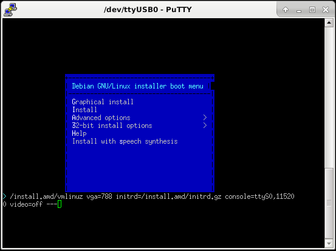
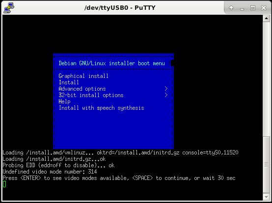

# How to Install Debian on Alix and Apu2

## Apu2

[PC Engines APU2 Board](https://www.pcengines.ch/apu2.htm)

* Baudrate 115200
* Tested with Debian Strech

1. Connect to the Apu2 over a serial cable. You can use any serial console client, for example PuTTY.
  

1. Insert the USB Stick with the current Debian amd64 installer, like [this](http://mirror.switch.ch/ftp/mirror/debian-cd/current/amd64/iso-cd/debian-9.3.0-amd64-netinst.iso).
1. Boot the Apu board and press F10 to Enter die Boot Menu.
1. Choose your Installer stick, in my case is  was number 2.
  
1. Choose install and press TAB to change the boot parameter. Remove the `--- quiet` and add  `console=ttyS0,115200 video=off ---`
  
1. When you get the undefined video mode number message, just wait 1 to 2 minutes.
  
1. Proceed with the Debian installer as on a normal computer with vga until you geh the "Installation complete" message.
   
1. Choose Go Back -> Execute a shell (at the bottom of the menu) -> Enter
1. Mount special file systems (sys, proc and dev) into target. Like this: `mount -o bind /sys /target/sys`
1. Chroot into your new system `chroot /target`
1. Open /etc/default/grub with your favorite editor.
1. Set GRUB_CMDLINE_LINUX_DEFAULT to 'console=ttyS0,115200'
1. Execute `update-grub2`
1. Exit the chroot, the console, choose finish the installation in the installer and reboot the device.

## Alix

* Baudrate 38400

Follows...

## Sources
(https://lists.debian.org/debian-boot/2012/08/msg00815.html)

(https://www.coreboot.org/Serial_console)
